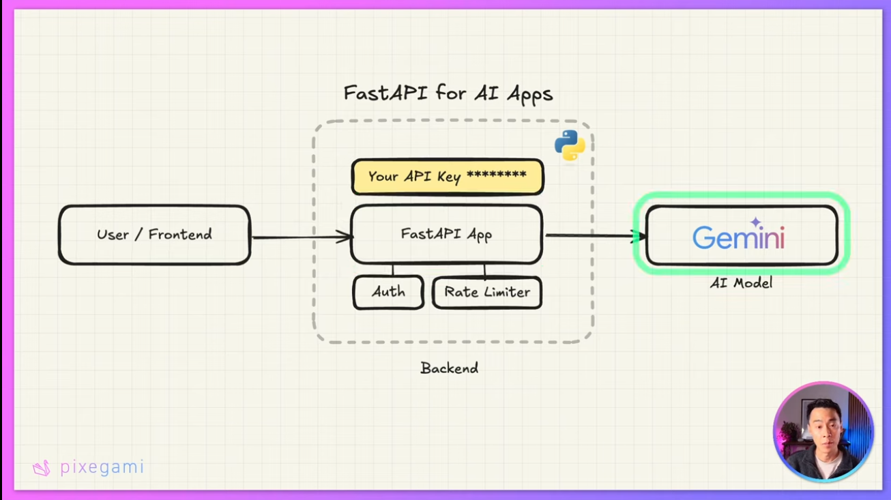

# FastAPI-AI

This is a FastAPI app that uses OpenRouter.ai to generate AI-powered chatbot responses.

## Flowchart of the FastAPI app



## Technologies Used

- [FastAPI](https://fastapi.tiangolo.com/) - A modern, fast (high-performance), web framework for building APIs with Python 3.7+ based on standard Python type hints.
- [Google generative AI](https://ai.googleblog.com/2022/04/announcing-generative-ai-with.html) - A new generation of AI that can generate human-like text, images, and even videos.
- [OpenRouter.ai](https://openrouter.ai/) - A free, open-source, and easy-to-use API that allows you to easily integrate AI-powered chatbots into your website.
- [Pydantic](https://pydantic-docs.helpmanual.io/) - A data modeling library that allows you to define data models using Python type hints.
- [Uvicorn](https://www.uvicorn.org/) - A lightning-fast ASGI server for Python.
- [UV](https://github.com/astral-sh/uv) - An extremely fast Python package and project manager, written in Rust.
- [JWT](https://jwt.io/) - A compact, URL-safe means of representing claims to be transferred between two parties. The claims in a JWT are encoded as a JSON object that is digitally signed using JSON Web Signature (JWS).


## Running the FastAPI app
We are using `uv` for the Python environment and uvicorn to run the FastAPI app. You can run the app using the following command:  


```bash
# install dependencies
uv sync
# run the FastAPI app
uv run uvicorn main:app --reload
```


## OPEN ROUTER AI

OpenRouter.ai is a free, open-source, and easy-to-use API that allows you to easily integrate AI-powered chatbots into your website. With OpenRouter.ai, you can create a chatbot that can answer questions, provide information, and even generate text based on user input. You can use OpenRouter.ai to create chatbots for your website, social media platforms, or any other application that requires AI-powered conversation.

### Installation

```bash
pip install openai
```

### Usage

**_Using the OpenAI SDK_**

```python
from openai import OpenAI

client = OpenAI(
  base_url="https://openrouter.ai/api/v1",
  api_key="<OPENROUTER_API_KEY>",
)

completion = client.chat.completions.create(
  extra_headers={
    "HTTP-Referer": "<YOUR_SITE_URL>", # Optional. Site URL for rankings on openrouter.ai.
    "X-Title": "<YOUR_SITE_NAME>", # Optional. Site title for rankings on openrouter.ai.
  },
  model="openai/gpt-4o",
  messages=[
    {
      "role": "user",
      "content": "What is the meaning of life?"
    }
  ]
)

print(completion.choices[0].message.content)
```

**_Using the OpenRouter API directly_**

```python
import requests
import json

response = requests.post(
  url="https://openrouter.ai/api/v1/chat/completions",
  headers={
    "Authorization": "Bearer <OPENROUTER_API_KEY>",
    "HTTP-Referer": "<YOUR_SITE_URL>", # Optional. Site URL for rankings on openrouter.ai.
    "X-Title": "<YOUR_SITE_NAME>", # Optional. Site title for rankings on openrouter.ai.
  },
  data=json.dumps({
    "model": "openai/gpt-4o", # Optional
    "messages": [
      {
        "role": "user",
        "content": "What is the meaning of life?"
      }
    ]
  })
)
```

## JWT Authentication
JWT (JSON Web Token) is a compact, URL-safe means of representing claims to be transferred between two parties. The claims in a JWT are encoded as a JSON object that is digitally signed using JSON Web Signature (JWS). This allows you to verify the authenticity of the token and ensure that it has not been tampered with.

